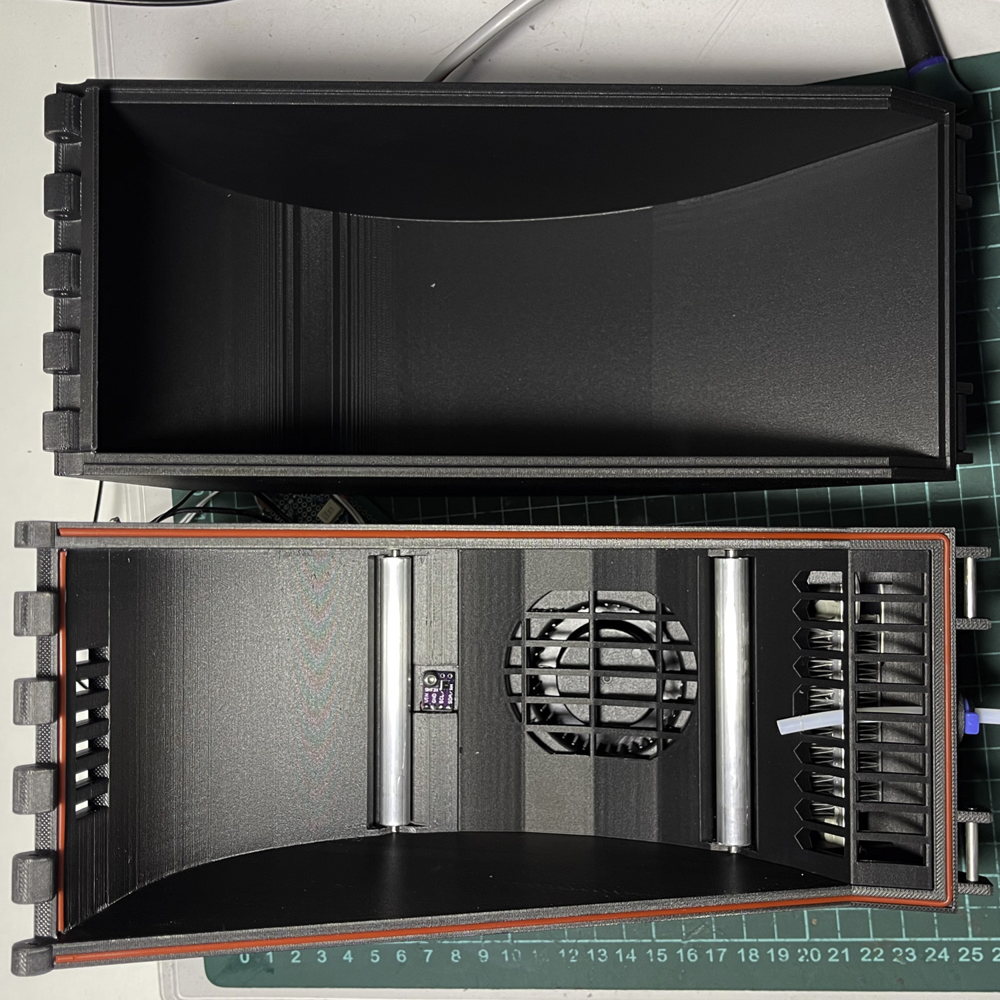
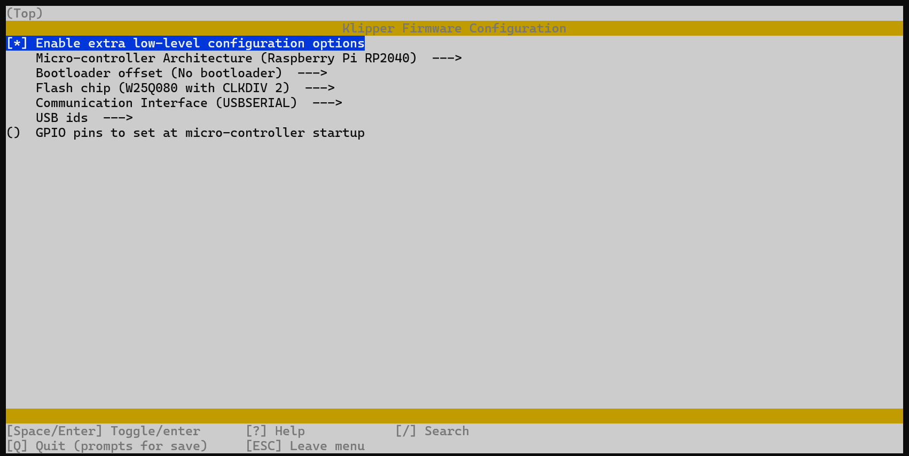

### [](https://t.me/iDryer)  [](https://www.youtube.com/@iDryerProject) [](https://github.com/pavluchenkor/iDryer-Unit)

# iDryer Unit - система сушки пластика для 3D-принтеров на базе Klipper
### В разработке


Этот проект представляет собой систему управления сушкой пластика для 3D-принтеров, работающую под управлением прошивки Klipper и включающую до четырех сушилок с индивидуальными параметрами работы.


## Особенности проекта

  

- **Режим сушки и хранения**: Возможность сушки пластика при температуре до 90°C и поддержание оптимальной температуры и влажности для хранения пластика.
- **Корпус сушилки**: Корпус печатается на 3D-принтере.
- **Интеграция с Klipper**: Вся информация о процессе сушки выводится в интерфейсе Klipper для удобного мониторинга и управления.
- **Централизованная архитектура**: Одна сушилка оснащена MCU и выступает в роли управляющего блока, остальные сушилки подключаются к ней и управляются через периферию. Также возможна настройка iDryer как отдельного экземпляра Klipper для работы с отдельной системой управления или как второго MCU, подключенного к основной плате принтера на один экземпляр Klipper.
- **Подключение дополнительных модулей**: Дополнительные сушилки подключаются к управляющей с помощью патчкордов через RJ45 разъёмы для надёжной связи.
- **Поддержка до четырёх сушилок**: Каждая сушилка может обслуживать одну или две катушки пластика одновременно.
- **Безопасность**: Алгоритмы безопасности Klipper и использование термостата KSD9700 на 130°C для предотвращения аварий делают систему безопасной для бытового применения.
- **Эффективность сушки**: За счет использования датчика влажности и системы проветривания камеры, которая управляется сервоприводом заслонки по расписанию, достигаются оптимальные результаты сушки пластика в кратчайшие сроки.
  
  


## Преимущества использования

- **Улучшенное качество печати**: Сухой пластик обеспечивает стабильную экструзию и высокое качество печати.
- **Эффективность**: Одновременная сушка нескольких катушек экономит время и повышает производительность.
- **Гибкость**: Система может быть расширена или настроена под конкретные нужды.
- **Безопасность**: Аппаратные и программные средства обеспечивают безопасную работу системы.

## Технические детали

- **MCU**: Используется для управления основной сушилкой и координации работы дополнительных модулей. По умолчанию подключается U1, остальные устройства (U2, U3, U4) можно подключить по необходимости для расширения системы. Возможна настройка iDryer как отдельного экземпляра Klipper для работы с отдельной системой управления (например, на Raspberry Pi, с двумя экземплярами Klipper: один для принтера, другой для сушилки) или как второго MCU, подключенного к основной плате принтера на один экземпляр Klipper.
- **Термостат KSD9700**: Биметаллический термостат на 130°C обеспечивает защиту в аварийной ситуации и отключает нагреватель.
- **Температурный режим**: Сушка проводится при температуре до 90°C, что подходит для большинства видов пластика.
- **Интерфейсы подключения**: RJ45 разъёмы используются для соединения между сушилками, что упрощает монтаж и обеспечивает надёжное соединение.

## Установка и настройка

1. **Сборка оборудования**: Соберите основную сушилку с MCU и необходимые дополнительные модули.
2. **Подключение**: Соедините дополнительные модули с управляющей сушилкой с помощью патчкордов через RJ45 разъёмы. По умолчанию подключается U1, а дополнительные модули (U2, U3, U4) можно подключить, добавив соответствующие конфигурационные файлы.
3. **Настройка Klipper**: Интегрируйте систему сушки в конфигурацию Klipper.
4. **Тестирование**: Проверьте работу системы и убедитесь в корректности отображения данных в интерфейсе Klipper.

## Требования

- 3D-принтер с установленной прошивкой Klipper.
- плата iDryer с MCU для основной сушилки.
- Термостат KSD9700 на 130°C для каждой сушилки.
- RJ45 патчкорды и разъёмы для подключения дополнительных модулей к основной сушилке.
- Дополнительные платы управления iDryer Unit по количеству подключаемых сушилок.

---

# Конфигурация iDryer для Klipper

Этот репозиторий содержит конфигурационные файлы для сушилки пластика iDryer, основанной на прошивке Klipper и плате управления iDryer Unit с микроконтроллером RP2040. Конфигурация предназначена для автоматизации процесса сушки пластика для 3D-принтеров, включая контроль температуры и влажности.

## Оглавление

- [Требования](#требования)
- [Подготовка](#подготовка)
- [Установка прошивки на iDryer Unit](#установка-прошивки-на-idryer-unit)
- [Конфигурация Klipper](#конфигурация-klipper)
  - [Подключение MCU iDryer](#подключение-mcu-idryer)
  - [Настройка нагревателя](#настройка-нагревателя)
  - [Настройка вентилятора](#настройка-вентилятора)
  - [Настройка датчиков температуры и влажности](#настройка-датчиков-температуры-и-влажности)
  - [Макросы G-кода](#макросы-г-кода)
- [Использование](#использование)
- [Модели для 3д печати](#модели-для-печати)
- [Примечания](#примечания)

## Требования

- **Аппаратное обеспечение:**

  - Плата управления iDryer Unit с микроконтроллером RP2040
  
  
  - Терморезистор NTC 100K для контроля температуры (или любой другой датчик, поддерживаемый прошивкой Klipper)
  - Нагревательный элемент (оптимально 220В, 100Вт)
  - Вентилятор для циркуляции воздуха в сушилке
  - Датчик температуры и влажности (например, SHT3X, но может быть любой другой, поддерживаемый Klipper) &#x20;
  - Дополнительная плата
 


- **Программное обеспечение:**

  - Klipper (последняя версия)
  - Настроенный 3D-принтер с прошивкой Klipper

## Подготовка

1. **Сборка аппаратной части:**

   - Подключите нагревательный элемент и вентилятор к плате iDryer Unit.
   - Установите терморезистор и датчик SHT3X (или любой другой поддерживаемый датчик температуры/влажности) в сушилке и подключите их к соответствующим пинам на плате.

2. **Установка необходимых файлов:**

   - Скопируйте файлы `rp2040_pin_aliases.cfg`, `iDryer.cfg` и другие конфигурационные файлы в директорию конфигурации Klipper.

## Установка прошивки на iDryer Unit

### 1. Подготовка прошивки:

Если прошивка для RP2040 ещё не установлена:

- В меню конфигурации прошивки Klipper:
  - Войдите в меню конфигурации, используя команду в терминале.
  
```bash
make menuconfig
```
  
  - Выберите архитектуру **RP2040**.

  - Остальные параметры оставьте по умолчанию.

### 2. Сборка прошивки:

Выполните сборку прошивки:

```bash
make
```

### 3. Установка прошивки на iDryer Unit:

- Подключите плату iDryer Unit к компьютеру в режиме программирования (удерживая кнопку BOOT при подключении).

    ***эта секция может отличаться в зависимости от архитектуры и OS хоста***

- Смонтируйте устройство и загрузите прошивку:

```bash
sudo mount /dev/sda1 /mnt
sudo cp out/klipper.uf2 /mnt
sudo umount /mnt
```

## Конфигурация Klipper

### 1. Включение конфигурации iDryer:

В файл `printer.cfg` необходимо добавить строку для включения конфигурационного файла `iDryer.cfg`:

```ini
[include iDryer.cfg]
```

### Подключение MCU iDryer

[Найдите серийный порт вашего микроконтроллера:](https://www.klipper3d.org/Installation.html#building-and-flashing-the-micro-controller)


```bash
ls /dev/serial/by-id/*
```
и укажите его в конфигурационном файле

```ini
[mcu]
serial: /dev/serial/by-id/usb-Klipper_rp2040_DE63581213745233-if00
```

По умолчанию подключен U1, однако вы можете подключить дополнительные модули, такие как U2, U3, U4, добавив соответствующие конфигурационные файлы:

```ini
[include U1.cfg]
[include U2.cfg]
[include U3.cfg]
[include U4.cfg]
```

Таким образом, система может быть расширена для управления несколькими сушилками. iDryer может быть настроен как отдельный экземпляр Klipper, установленный на Raspberry Pi, для независимой работы или как второй MCU, подключённый к основной плате принтера и использующий один экземпляр Klipper:

```ini
[mcu iDryer]
serial: /dev/serial/by-id/usb-Klipper_rp2040_DE63581213745233-if00
```

### Настройка нагревателя

```ini
[heater_generic iDryer_M_Heater]
heater_pin: H0
max_power: 1
sensor_type: NTC 100K MGB18-104F39050L32
sensor_pin: T0
control: pid
pwm_cycle_time: 0.3
min_temp: 0
max_temp: 120
pid_Kp=32.923
pid_Ki=5.628
pid_Kd=48.150
```

### Настройка вентилятора

```ini
[heater_fan Master_Fan]
fan_speed: 1
pin: FAN0
heater: iDryer_M_Heater
heater_temp: 55
```

### Настройка датчиков температуры и влажности

Вы можете использовать любой датчик температуры и влажности, поддерживаемый Klipper. В примере используется датчик **SHT3X**, подключённый через интерфейс I2C. Датчики для сушилок U1 и U2 подключены к одной шине I2C, а датчики для сушилок U3 и U4 подключены к другой шине I2C. Адреса датчиков на каждой шине должны отличаться:

```ini
[temperature_sensor iDryer_M_Air]
sensor_type: SHT3X
i2c_address: 68
i2c_software_sda_pin: gpio18
i2c_software_scl_pin: gpio19
```

**Примечание:** Если вы используете другой датчик температуры или влажности, проверьте документацию Klipper для соответствующей конфигурации.

### Макросы G-кода

Для управления процессом сушки с возможностью установки температуры для разных материалов, используйте следующие макросы:

```ini
[gcode_macro iDryer_OFF]
gcode:
    SET_HEATER_TEMPERATURE HEATER=iDryer_M_Heater TARGET=0
    UPDATE_DELAYED_GCODE ID=_UPDATE_UNIT1_DATA DURATION=0
    UPDATE_DELAYED_GCODE ID=_TOGGLE_SERVO1 DURATION=0

[gcode_macro DRY_UNIT1]
gcode:
    
    SET_GCODE_VARIABLE MACRO=DRY_MODE_U1 VARIABLE=temp VALUE={unit_temp}

[gcode_macro ABS_U1]
variable_unit_temp: 80
variable_unit_duration: 240
gcode:
    DRY_MODE_U1 UNIT_TEMPERATURE={unit_temp} HUMIDITY=10 TIME={unit_duration}

[gcode_macro PA_U1]
variable_unit_temp: 90
variable_unit_duration: 240
gcode:
    DRY_MODE_U1 UNIT_TEMPERATURE={unit_temp} HUMIDITY=10 TIME={unit_duration}

[gcode_macro PETG_U1]
variable_unit_temp: 65
variable_unit_duration: 240
gcode:
    DRY_MODE_U1 UNIT_TEMPERATURE={unit_temp} HUMIDITY=10 TIME={unit_duration}

[gcode_macro PLA_U1]
variable_unit_temp: 55
variable_unit_duration: 240
gcode:
    DRY_MODE_U1 UNIT_TEMPERATURE={unit_temp} HUMIDITY=10 TIME={unit_duration}
```

### Макрос для обновления данных:

```ini
[delayed_gcode _UPDATE_UNIT1_DATA]
gcode:
    
    
    
    
    { action_respond_info("Unit_1 T: %s H: %.2f%%" %(temperature, printer["sht3x iDryer_M_Air"].humidity)) }
    
    
        
    
        
    
        
        
            
        
    
    
    SET_HEATER_TEMPERATURE HEATER=iDryer_M_Heater TARGET={target_temp|int}
    UPDATE_DELAYED_GCODE ID=_UPDATE_UNIT1_DATA DURATION=1
```

### Макросы для установки температуры:

- Для ABS-пластика:

```gcode
ABS_U1
```

- Для PLA-пластика:

```gcode
PLA_U1
```

- Для PETG-пластика:

```gcode
PETG_U1
```

## Использование

- Установка температуры для сушки:

```gcode
DRY_UNIT1 UNIT_TEMPERATURE=60
```

- Остановка нагрева:

```gcode
iDryer_OFF  ; Отключить нагрев сушилки
```

### Модели для печати
!!! success "🛠️ Файлы для печати"

    **[Корпус](CAD/Set%201.3mf)**
    **[Детали](CAD/Set%101.3mf)**
    **[Таблички](CAD/Nameplate%20UNIT.3mf)**

    Параметры печати корпуса:

    - материал ABS, ABS-CF, ABS-GF, PP

    - ширина линии 0.6

    - количество периметров 1
    
    - заполнение 10%

    Все детали корпуса печатаются без поддержек

### Файлы конфигурации
!!! success "📁 Файлы конфигурации"

    **[iDryer](iDryer.cfg)**
    **[U1](U1.cfg)**
    **[U2](U2.cfg)**
    **[U3](U3.cfg)**
    **[U4](U4.cfg)**
  


## Обратная связь

Если у вас есть вопросы или предложения по улучшению системы, пожалуйста, создайте issue в этом репозитории или свяжитесь напрямую.

Или посетите группу в телеграм

### [](https://t.me/iDryer) 

[](https://www.youtube.com/@iDryerProject)

[](https://github.com/pavluchenkor/iDryer-Unit)


## Примечания

- Убедитесь в правильности подключения датчиков температуры и влажности (например, SHT3X или другого).
- Для оптимального контроля температуры может потребоваться калибровка PID.
- Следите за показаниями температуры и влажности с помощью макросов для более точной настройки условий сушки.
- Проект находится в стадии разработки.

***Внимание: Использование нагревательных элементов и управление температурой связано с риском возгорания и повреждения оборудования. Всегда следуйте рекомендациям производителя и соблюдайте меры предосторожности и электробезопасности. Не оставляйте включенные электрические устройства без присмотра.***

